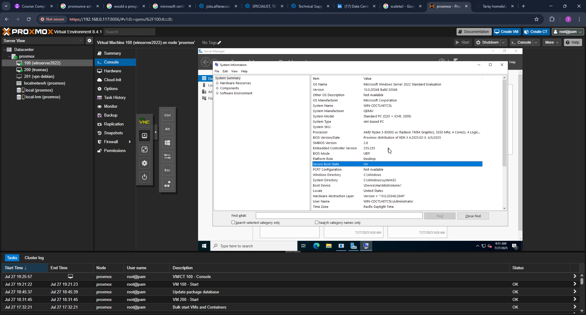
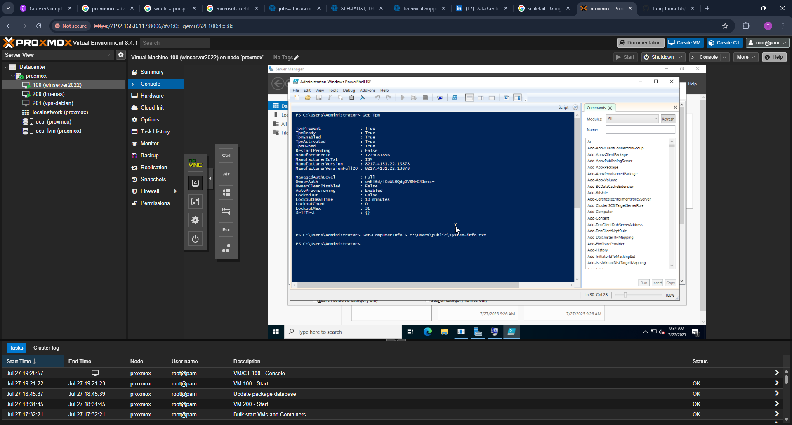

# Windows Server 2022: AD & BitLocker Lab

This lab simulates an enterprise Windows Server 2022 environment focused on identity, access, and data protection. It includes the deployment of Active Directory Domain Services (AD DS), Group Policy configuration, and BitLocker full disk encryption using TPM 2.0.

Each part of the lab is broken into GitHub branches to isolate functionality and show progression over time.

---

## Part 1: VM Setup and TPM Verification

> **Note:** The base Windows Server 2022 VM installation was completed in a separate project.  
> For installation and VM configuration steps, see:  
> [vms-containers](https://github.com/Tariq-homelab/vms-containers)

### What Was Done

- Accessed the virtual machine via Proxmox Console (noVNC)
- Verified UEFI boot mode and Secure Boot status using System Information
- Confirmed TPM 2.0 presence via PowerShell
- Collected system information using `Get-ComputerInfo`
- Captured supporting screenshots for documentation

### Commands Used

```
Get-Tpm
Get-ComputerInfo > C:\Users\Public\system-info.txt
```

### Screenshots

| Description                        | File                                               |
|-----------------------------------|----------------------------------------------------|
| System Information (UEFI Boot)    |  |
| TPM Check and SystemInfo Export   |  |

---

## Next Step

### Part 2: Active Directory Domain Services (AD DS) Setup

- Install AD DS role
- Promote to Domain Controller
- Configure root domain and DNS
- Create initial OU structure
