# Part 3: BitLocker Group Policy Enforcement (Windows Server 2022 Lab)

This phase demonstrates how to centrally enforce BitLocker encryption in a Windows domain environment using Group Policy. It includes domain controller preparation, GPO creation, TPM support, client policy enforcement, and recovery key verification.

---

## Skills Demonstrated

- BitLocker drive encryption
- Group Policy Management (GPO)
- Domain join and hostname conventions
- TPM 2.0 emulation in Proxmox
- AD DS recovery key backup
- `gpresult` verification

---

## Lab Overview

### 1. Add TPM 2.0 to Windows 10 VM

Enabled TPM 2.0 in the `win10-client` VM via Proxmox hardware settings to support BitLocker.

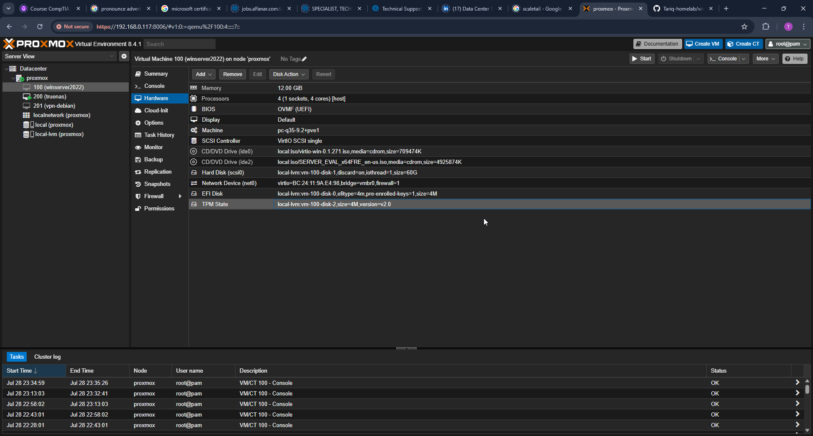

---

### 2. Create GPO for BitLocker

Used Group Policy Management to create a new GPO named `BitLocker Policy`.

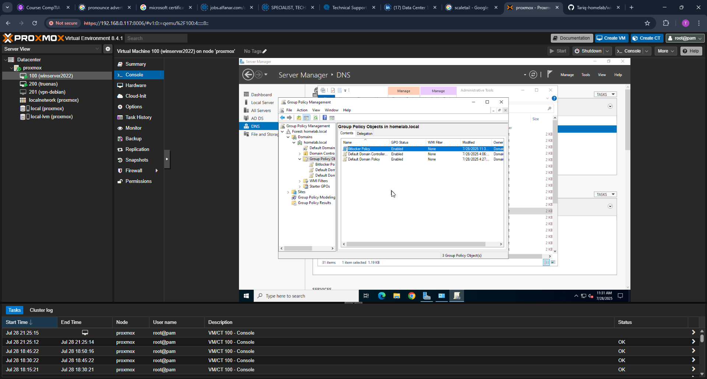

---

### 3. Require Authentication at Startup

Enabled the policy to require additional authentication at startup. Allowed TPM or TPM+PIN.

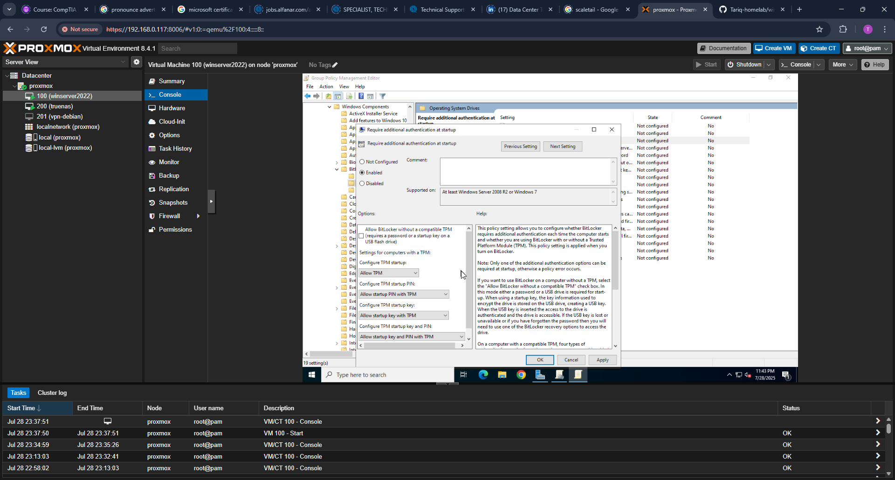

---

### 4. Enable Recovery Information in AD

Configured the GPO to store BitLocker recovery keys in Active Directory automatically.

---

### 5. Link GPO to Domain

Linked the `BitLocker Policy` GPO to the root of the domain.

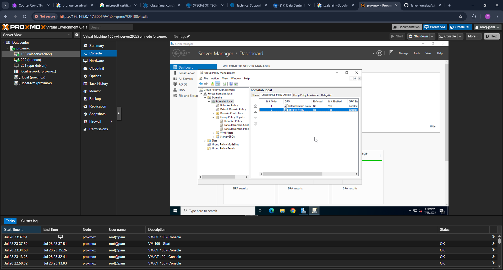

---

### 6. Rename Client Hostname

Renamed the Windows 10 VM to a recognizable name (`win10-client`) and restarted.

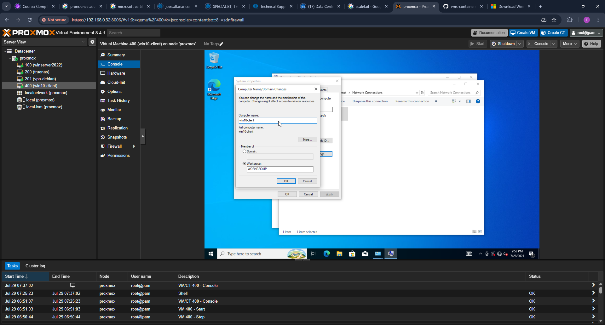

---

### 7. Join Client to Domain

Joined the `win10-client` VM to the Active Directory domain (`homelab.local`) and restarted.

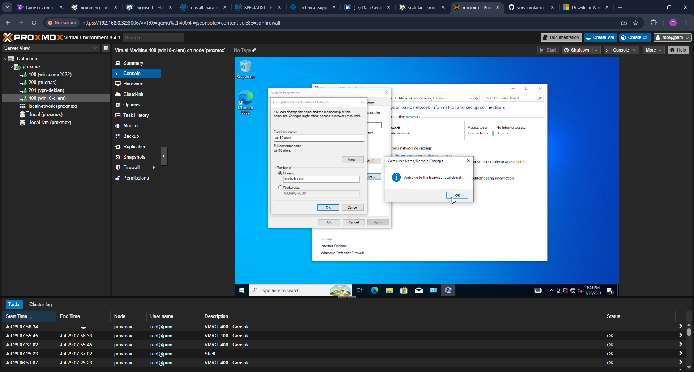

---

### 8. Force Group Policy Update

Ran `gpupdate /force` and confirmed successful execution.

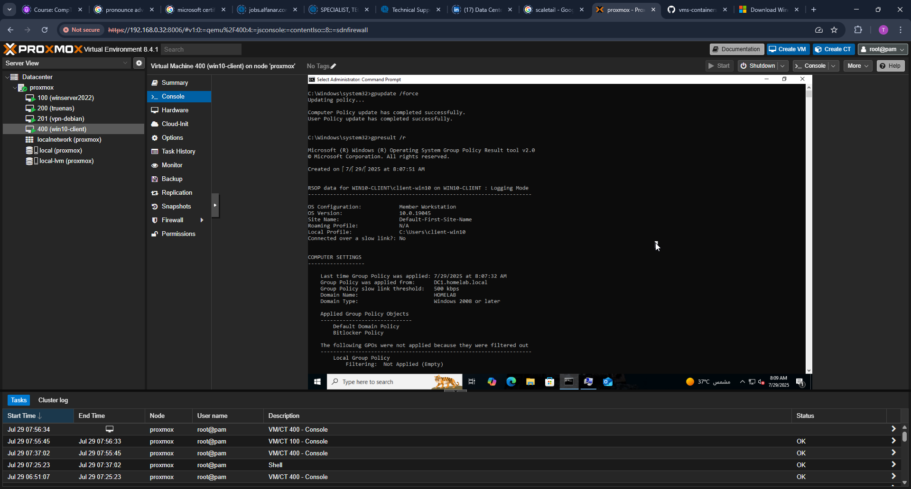

---

### 9. Confirm GPO Application with `gpresult`

Verified that the BitLocker policy GPO applied to the machine and user context.

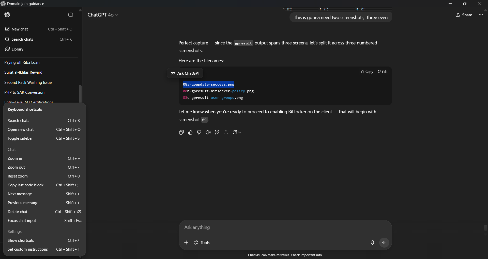

---

### 10. Enable BitLocker on C: Drive

Manually initiated BitLocker drive encryption on the client VM.

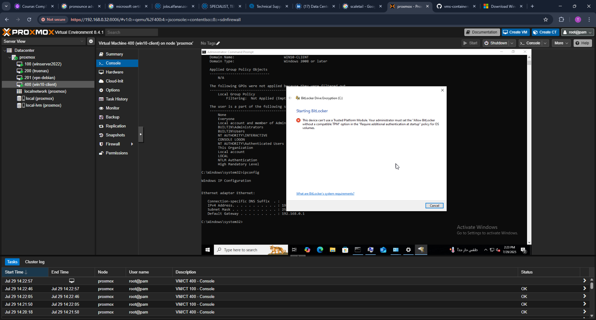

---

### 11. Allow BitLocker Without Compatible TPM

Verified that Group Policy allowed BitLocker to use TPM without additional password/PIN.

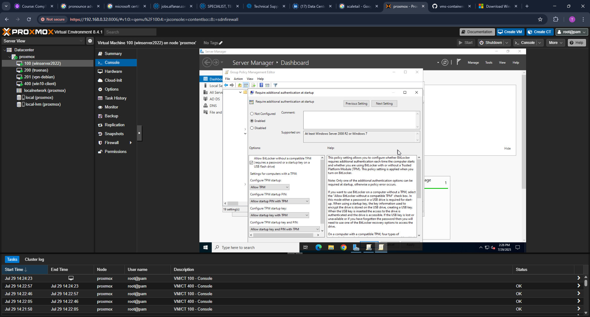

---

### 12. Save Recovery Key to Network Share

Saved the generated BitLocker recovery key to a shared folder on the domain controller (`winserver2022`).

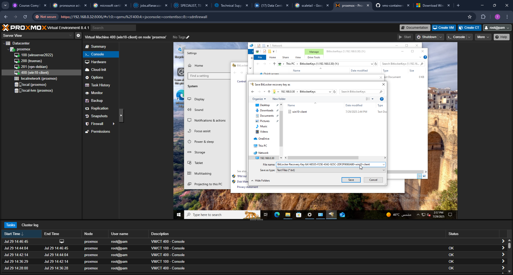

---

### 13. Restart Required After Setup

Restarted the VM to complete BitLocker initialization.

---

### 14. BitLocker Pre-Boot Authentication

BitLocker prompt displayed during boot, requiring password to unlock the drive.

---

### 15. BitLocker Encryption Confirmed

Confirmed encryption status in Control Panel > BitLocker Drive Encryption.

---

### 16. Recovery Key Stored on Server

Verified the recovery key was successfully saved to the server-side share.

---

## Next Steps

This completes the BitLocker GPO enforcement lab. The next phase will explore:

- Automatic BitLocker deployment via task sequences (MDT or SCCM)
- Group Policy WMI filtering for BitLocker by model or drive type
- Auditing BitLocker status across domain machines
