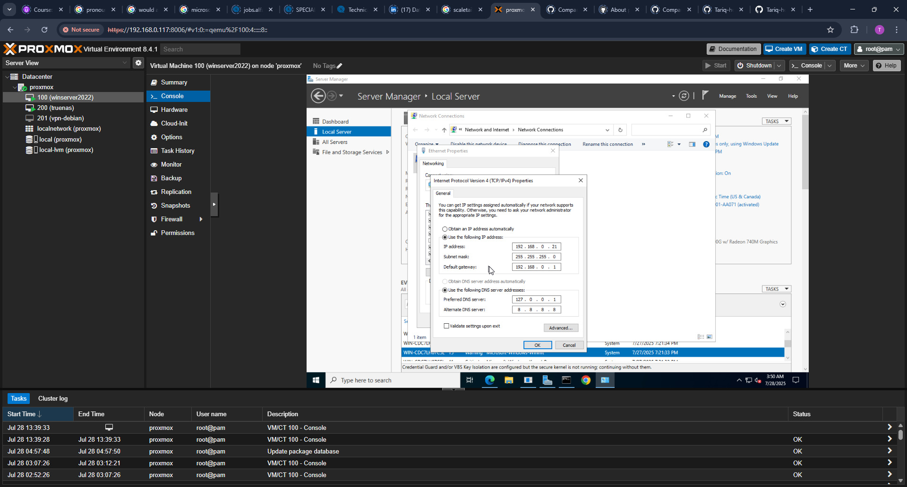
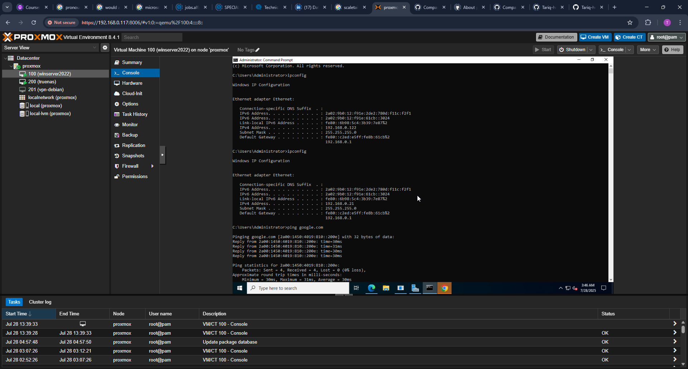
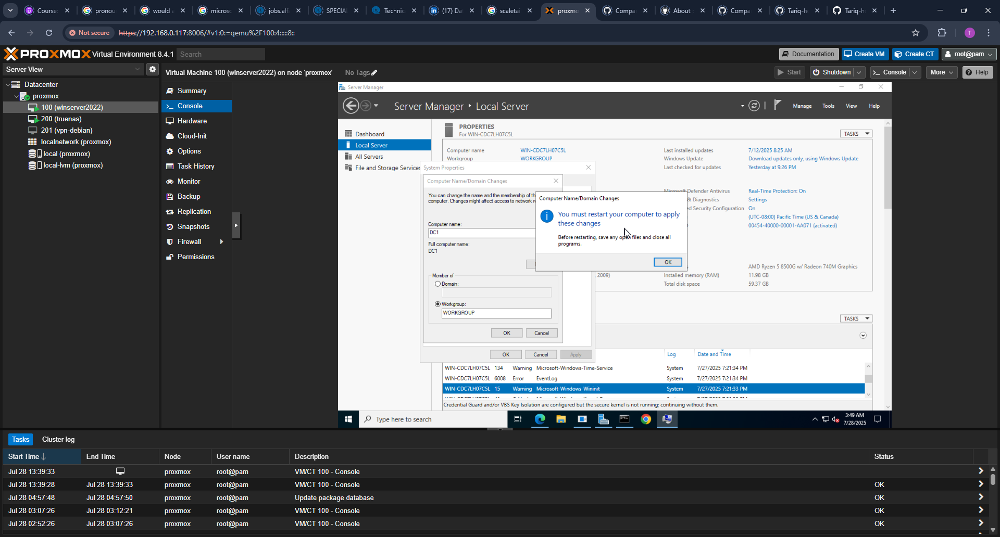
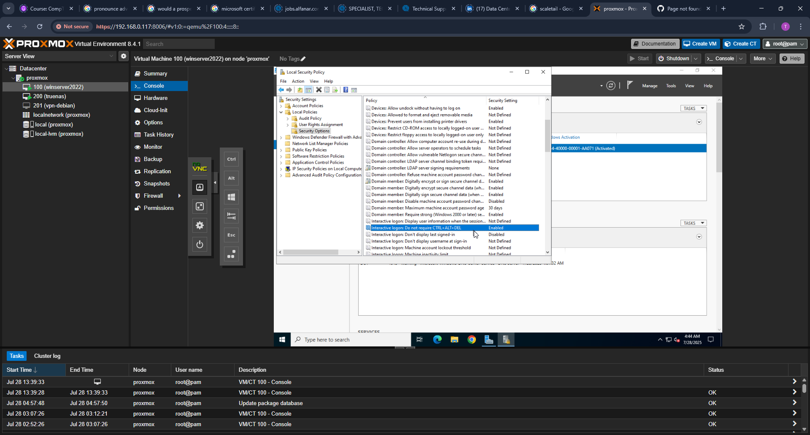
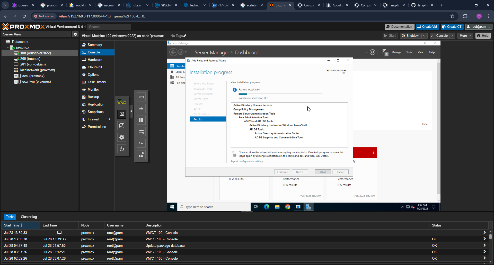
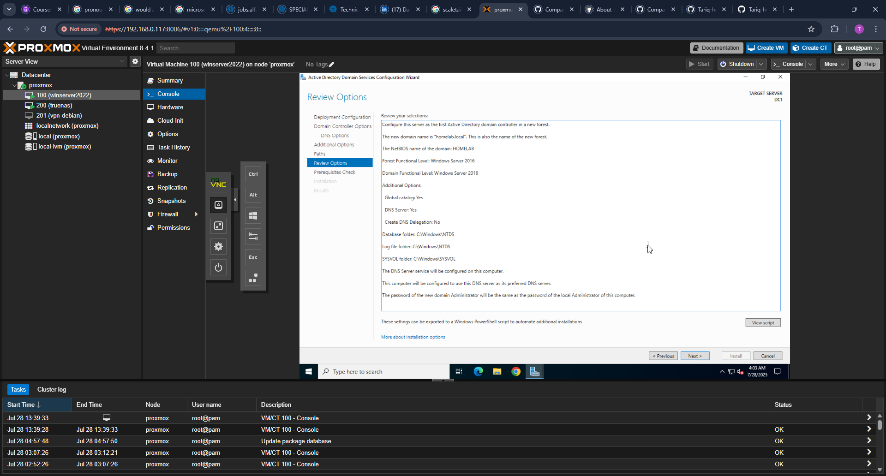
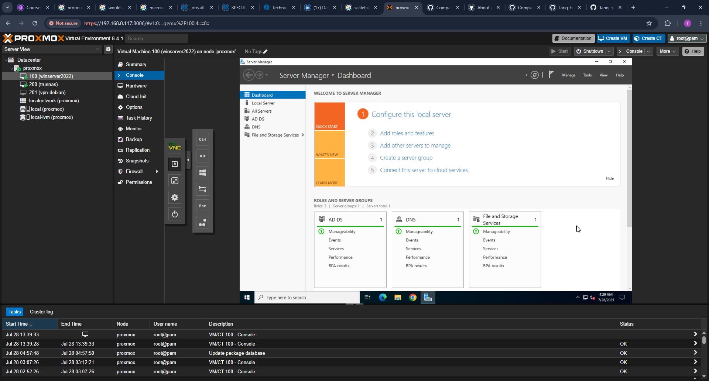
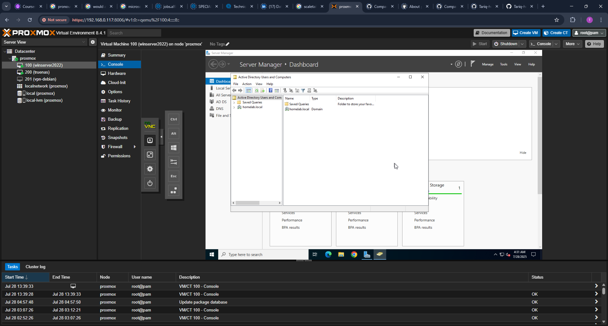
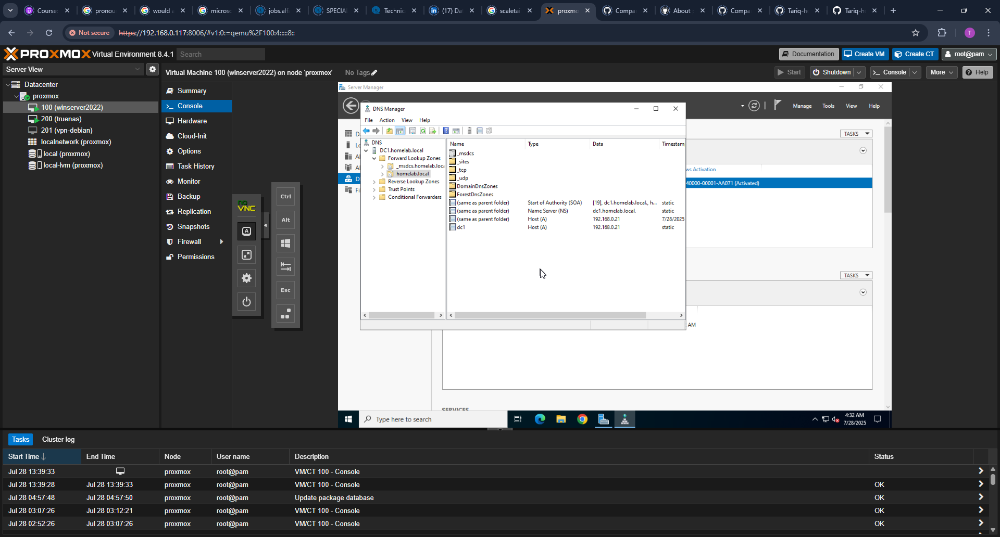

# Part 2 – Active Directory Domain Services Setup

This phase documents the installation and promotion of a Windows Server 2022 machine (`DC1`) to a Domain Controller for the `homelab.local` domain. This includes static IP assignment, server renaming, AD DS role installation, DNS configuration, and domain verification.

---

## Static IP Configuration

A static IP address was configured to ensure consistent network identity and domain functionality.

---

## Internet Access Verification

Ping was tested after assigning the static IP to ensure proper gateway and DNS settings.

---

## Renaming the Server

The default server name was changed to `DC1` to reflect its role as the first domain controller.

---

## Disable Ctrl+Alt+Del Requirement

To streamline VM login during lab work, the Ctrl+Alt+Del prompt was disabled via local security policy.

---

## Installing AD DS Role

The Active Directory Domain Services role was installed using Server Manager.

---

## Domain Promotion

The server was promoted to a Domain Controller for the new forest `homelab.local`.

---

## Post-Promotion Verification

### Server Roles Confirmed

AD DS and DNS roles appeared successfully in Server Manager.

### Active Directory Console

The `homelab.local` domain appeared in ADUC, confirming domain services are active.

### DNS Forward Lookup Zone

The DNS role created a Forward Lookup Zone for `homelab.local`, with authoritative records for the DC.

---

## Summary

This part completed the foundational setup of the Active Directory environment, including:
- Static IP networking
- Domain Controller promotion
- DNS zone validation

The server is now ready for organizational unit creation, user provisioning, and Group Policy configuration in upcoming phases.

---

## Next Steps

With the domain controller fully promoted and DNS verified, the environment is now ready for further Active Directory structuring and policy enforcement. The next steps include:

- Creating Organizational Units (OUs) to simulate departmental hierarchy
- Provisioning standard domain user accounts
- Configuring Security Groups for access control
- Defining and applying Group Policy Objects (GPOs)
- Preparing for BitLocker deployment and central key management

Each step will be documented in subsequent parts of this project to demonstrate practical domain administration in a lab environment.

