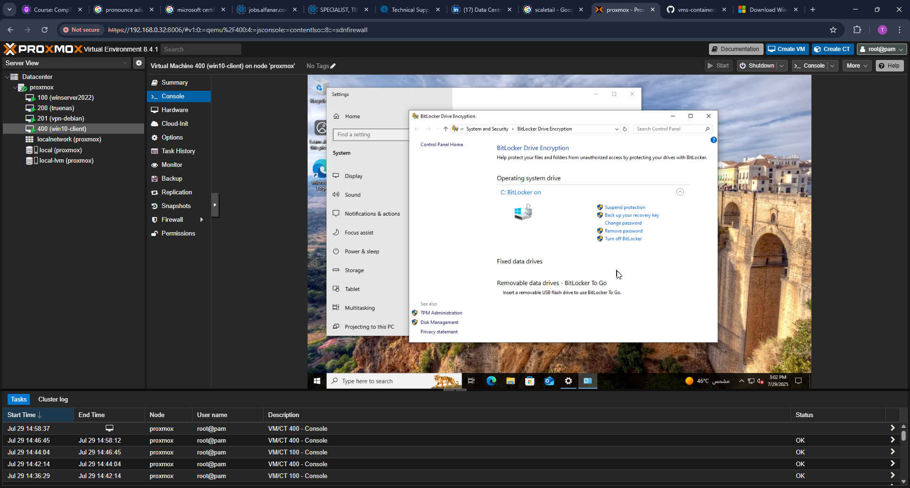
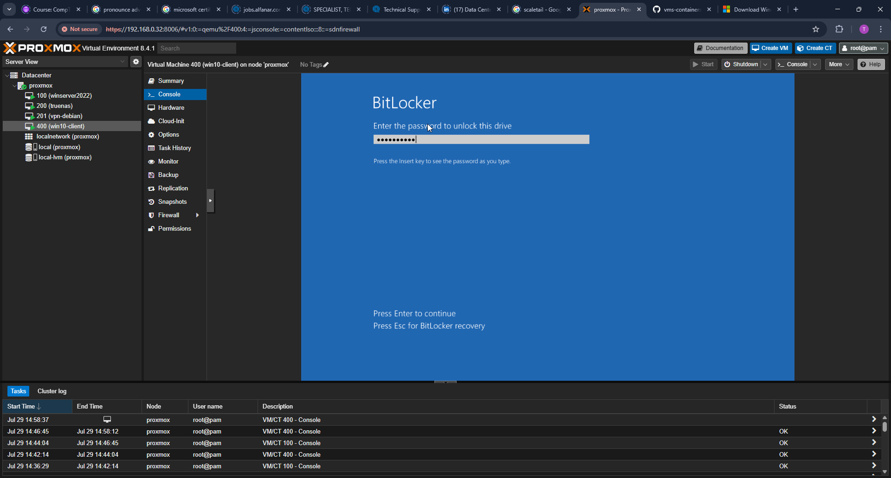

# Part 3: BitLocker GPO Enforcement and Verification

This documentation outlines the process of enforcing BitLocker encryption via Group Policy in an Active Directory environment, followed by verification of policy application and encryption behavior on a domain-joined Windows 10 client.

---

## 1. Create a GPO for BitLocker

A new GPO named **BitLocker Policy** was created within the Group Policy Management Console.


---

## 2. Add TPM 2.0 Device to VM

The Windows 10 Pro client VM was configured in Proxmox to include a virtual TPM 2.0 module to support hardware-based BitLocker encryption.


---

## 3. Require Startup Authentication

Group Policy setting **"Require additional authentication at startup"** was enabled with TPM selected to enforce pre-boot authentication.


---

## 4. Save Recovery Information to AD

Group Policy setting **"Save BitLocker recovery information to AD DS"** was enabled to allow storing recovery keys centrally in Active Directory.


---

## 5. Link GPO to Domain Root

The BitLocker Policy GPO was linked to the root of the domain (`homelab.local`) to apply settings across all domain-joined clients.


---

## 6. Rename Client Hostname

Before joining the domain, the Windows 10 client was assigned a consistent hostname.


---

## 7. Join Windows 10 Client to Domain

The system was successfully joined to the domain `homelab.local`.


---

## 8. Refresh and Check GPO Application

Group Policy was refreshed using `gpupdate /force`, and `gpresult /r` confirmed that the BitLocker Policy GPO was applied to the machine.

  


---

## 9. Verify GPO Security Filtering

The GPO’s scope and security filtering were validated in GPMC to confirm that it applies to authenticated users and computers.


---

## 10. Launch BitLocker and Observe Prompt

BitLocker was launched on the client machine. Due to TPM-only enforcement, a TPM-based confirmation screen appeared.


---

## 11. (Optional) TPM-less Scenario (Not Used)

The GPO setting to allow BitLocker without a compatible TPM was reviewed but left disabled to enforce TPM-only compliance.


---

## 12. Validate Recovery Key Storage Option

During BitLocker setup, the wizard indicated that the recovery key would be stored in Active Directory, confirming GPO enforcement.

  


---

## 13. Restart Prompt After Setup

After completing BitLocker configuration, a restart was required to begin encryption.


---

## 14. BitLocker Status: Encryption Started

Upon reboot, BitLocker began encrypting the drive. Status was shown directly in the BitLocker control panel.



---

## 15. Pre-Boot Authentication Prompt (TPM)

A pre-boot authentication prompt confirmed the use of TPM for boot security.



---

## 16. Recovery Key Stored in Active Directory

The client machine’s recovery key was successfully found within the corresponding computer object in Active Directory.


---

## 17. Enable Event Logging (Optional)

BitLocker-related event logging was enabled to assist with auditing and troubleshooting.


---

## 18. PowerShell: Verify Protection Status

Used PowerShell to verify that the volume was protected by BitLocker:

```powershell
Get-BitLockerVolume

---

19. Retrieve Key Protector ID  
Command used: (Get-BitLockerVolume -MountPoint "C:").KeyProtector  
Screenshot: images/18-get-protector-id.png

20. Confirm gpresult Summary  
Screenshots:  
- images/19-gpresult-summary-success.png  
- images/20-gpresult-bitlocker-policy-applied.png  
- images/21-gpresult-component-status-success.png

SUMMARY:  
- Group Policy settings for BitLocker were created, linked, and enforced.  
- TPM-based protection and recovery key storage in AD were verified.  
- Encryption was initiated and confirmed via both UI and PowerShell.  
- GPO application confirmed via gpresult, PowerShell, and AD inspection.

NEXT STEPS:  
Part 4 will focus on Active Directory user and group administration, OU structuring, and automation using PowerShell.

