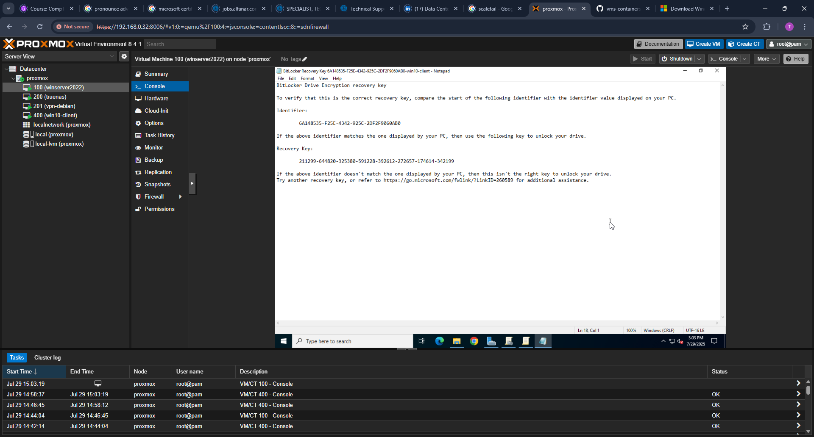
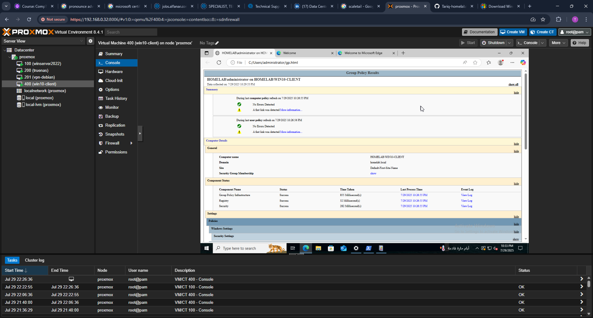

# Part 3 – BitLocker GPO Enforcement

This section demonstrates how BitLocker encryption was configured and enforced via Group Policy on a domain-joined Windows 10 client. The domain controller used was `winserver2022.homelab.local`, and the domain-joined client was `win10client.homelab.local`.

---

## 🎯 Objectives

- Configure a domain-level Group Policy Object (GPO) to enforce BitLocker encryption
- Require TPM-based startup authentication
- Store BitLocker recovery keys in Active Directory
- Verify GPO enforcement using gpupdate, gpresult, and ADUC
- Launch BitLocker on a domain-joined client and begin full drive encryption
- Confirm encryption and validate recovery key storage via multiple methods
- Test pre-boot authentication prompt
- Retrieve Key Protector ID via PowerShell
- Document and interpret all steps for portfolio and job readiness

---

## 1. Create BitLocker GPO

A new Group Policy Object named "BitLocker Policy" was created in the Group Policy Management Console.


---

## 2. Edit GPO: Require Additional Authentication at Startup

The policy `Require additional authentication at startup` was enabled to enforce the use of TPM or TPM+PIN during boot.


---

## 3. Edit GPO: Save BitLocker Recovery Info to AD DS

The policy `Choose how BitLocker-protected operating system drives can be recovered` was enabled. It was configured to store recovery information in Active Directory.


---

## 4. GPO Link to Domain

The BitLocker GPO was linked to the domain `homelab.local` so that it would apply to all relevant clients.


---

## 5. Force GPO Update on Client

On the Windows 10 domain-joined client, `gpupdate /force` was run to apply the latest GPO settings.


---

## 6. gpresult /h Report Generation

The `gpresult /h` command was used to generate a Group Policy Results report in HTML format to verify GPO application.


---

## 7. Open gpresult Report

The HTML report was opened and reviewed to confirm that the BitLocker GPO was applied.


---

## 8. Enable BitLocker via Control Panel

BitLocker Drive Encryption was launched via Control Panel to begin encrypting the system drive.


---

## 9. BitLocker Setup: Choose Encryption Options

Standard BitLocker setup options were selected, including TPM-based encryption with default settings.


---

## 10. Choose Save Method: AD DS + Network Drive

BitLocker recovery key was saved in both Active Directory and to a mapped network drive on the file server for redundancy.


---

## 11. Network Location for Recovery Key Backup

The mapped network share path was selected for saving the recovery key as a `.txt` file.


---

## 12. Confirm Saved Recovery Key File

The recovery key file was successfully saved on the network share, confirming key export to the SMB location.


---

## 13. Restart Prompt After Setup

After applying the BitLocker Group Policy settings, the system prompted for a restart to begin the encryption process.


---

## 14. BitLocker Status: Encryption Started

Upon reboot, the BitLocker control panel displayed the status "Encryption in progress," confirming that drive encryption had begun.


---

## 15. Pre-Boot Authentication Prompt (TPM)

The system displayed a pre-boot authentication screen confirming that TPM was used for BitLocker protection, as configured in the Group Policy.


---

## 16. Recovery Key Stored in Active Directory

The recovery key was confirmed to be stored in Active Directory. It was accessed through the computer object's properties under the "BitLocker Recovery" tab in Active Directory Users and Computers (ADUC).



---

## 17. Enable Event Logging (Optional)

BitLocker-related event logging was enabled to assist with auditing and troubleshooting.


---

## 18. Verify BitLocker Volume

Used PowerShell to verify that the volume was protected by BitLocker:

```powershell
Get-BitLockerVolume
```


---

## 19. Retrieve Key Protector ID

The protector ID associated with the encrypted volume was retrieved using the following command:

```powershell
(Get-BitLockerVolume -MountPoint "C:").KeyProtector
```


---

## 20. Confirm gpresult Summary

Final `gpresult /h` output confirmed that the BitLocker policy and its sub-components were fully applied.

  
  


---

## ✅ Summary

- Group Policy settings for BitLocker were created, linked, and enforced.
- TPM-based protection and recovery key storage in AD were verified.
- Encryption was initiated and confirmed via both UI and PowerShell.
- GPO application was confirmed with `gpresult`, PowerShell, and AD inspection.

---

## 🔜 Next Steps

Part 4 will focus on **Active Directory** user and group administration, OU structuring, and automation using PowerShell.
