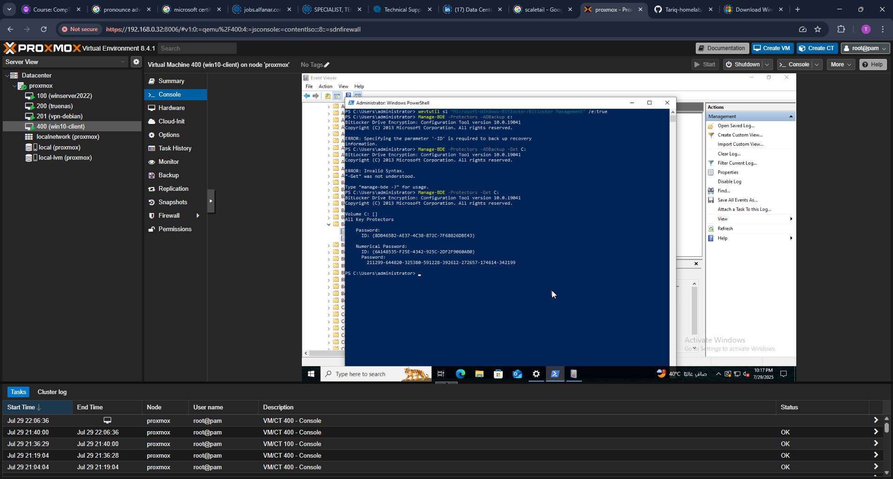

# BitLocker Group Policy Configuration and Validation

## Objectives

This lab demonstrates how to configure and enforce BitLocker drive encryption using Group Policy in a Windows Server 2022 Active Directory environment. It includes the following goals:

- Enforce TPM-based startup authentication for operating system drives.
- Configure BitLocker recovery key backup to Active Directory.
- Save recovery keys to a designated SMB network share.
- Verify encryption status through both GUI and PowerShell.
- Confirm storage of recovery keys in AD DS.
- Ensure auditing is enabled for security compliance.

---

## 1. Create BitLocker Policy GPO

A new Group Policy Object was created named "BitLocker Policy" to manage encryption settings.

## 2. Add TPM 2.0 to VM

The virtual machine was configured to include a TPM 2.0 device via Proxmox.

## 3. Require Authentication at Startup

The policy "Require additional authentication at startup" was enabled and set to allow TPM only or TPM + PIN.

## 4. Enable Recovery Info in AD

Configured policy to store BitLocker recovery keys in Active Directory.

## 5. Link BitLocker GPO to Domain

The GPO was successfully linked to the domain to enforce the settings.

## 6. Rename Hostname

The system hostname was renamed to follow lab naming standards.

## 7. Domain Join

The Windows 10 client was joined to the Active Directory domain.

## 8. Force Group Policy Update

Used `gpupdate /force` to apply new GPO settings.

## 8b. Confirm GPO BitLocker Policy

Used `gpresult` to confirm that BitLocker GPO was successfully applied to the client.

## 8c. Confirm GPO User Group

Validated the user group policy scope.

## 9. Enable BitLocker

BitLocker setup was launched and confirmed TPM availability.

## 10. Allow BitLocker Without TPM (GPO Fallback)

Displayed policy allowing BitLocker without a compatible TPM (optional testing scenario).

## 11. Mapped Network Drive

An SMB network share was mapped to store recovery keys.

## 12. Save BitLocker Recovery Key

The wizard showed the SMB path defined in GPO during the save step.

## 13. Restart Required After BitLocker Setup

After applying the BitLocker Group Policy settings, the system prompted for a restart to begin the encryption process.

## 14. BitLocker Encryption Confirmed

Upon reboot, the BitLocker control panel displayed the status "Encryption in progress," confirming that drive encryption had begun.

## 15. Recovery Key Stored on Server

The recovery key file was successfully saved on the network share, confirming key export to the SMB location.

## 16. Enable BitLocker Event Logging

Security logging for BitLocker activity was enabled via Group Policy.

## 17. BitLocker Policy Verification

Final GPO confirmation for BitLocker drive encryption enforcement.

## 18. Get Protector ID via PowerShell

Used PowerShell to retrieve BitLocker protector ID.

## 19. Gpresult Summary: Success

Final GPO report shows all policies applied successfully.

## 20. BitLocker Policy Applied

Confirmed BitLocker policy status applied to current user and computer context.

## 21. Component Status Success

Verified all BitLocker components were reported successful.

---

## Next Steps

In future extensions of this project, additional administrative tasks will be performed including:

- Bulk creation of Active Directory users and OUs
- Advanced GPO management (e.g., software deployment, script enforcement)
- Audit log collection and reporting
- Proxmox snapshot backup automation

This concludes Part 3: BitLocker GPO enforcement and validation.
