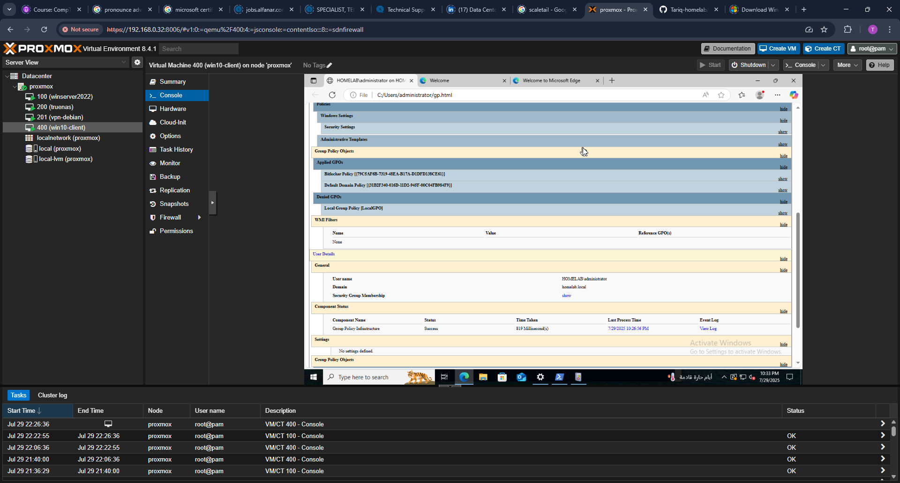
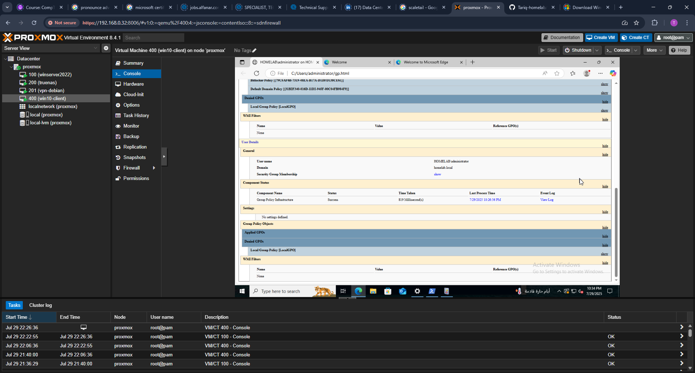

# Part 3 – BitLocker GPO Enforcement and Verification

This section covers the implementation of Group Policy Objects (GPOs) for BitLocker drive encryption, applying the policies to a domain-joined Windows 10 client, verifying the enforcement, and confirming backup of the recovery key to Active Directory.

---

## Procedures and Evidence

### 1. Create BitLocker Policy GPO
- Created new GPO: `BitLocker Policy`
- 

### 2. Attach TPM Module to VM
- Enabled TPM 2.0 on the Windows 10 VM via Proxmox
- 

### 3. Require Startup Authentication
- Enabled policy to require authentication at startup
- 

### 4. Enable AD DS Recovery Key Backup
- Configured BitLocker recovery key backup to AD DS
- 

### 5. Link GPO to Domain
- Linked the GPO to `homelab.local`
- 

### 6. Rename Client Hostname
- Renamed the Windows 10 client for clarity in AD
- 

### 7. Join Domain
- Joined the Windows 10 VM to the domain
- 

### 8. Force GPO Update
- Ran `gpupdate /force` to pull the new BitLocker policy
- 

### 9. Verify GPO Application via `gpresult`
- Confirmed user group membership
- 
- Verified BitLocker GPOs applied
- 

---

## BitLocker Activation and Monitoring

### 10. Allow BitLocker Without TPM
- Enabled GPO fallback option for machines without compatible TPM
- 

### 11. Enable BitLocker Encryption
- Launched BitLocker encryption process via Control Panel
- 

### 12. Map Network Drive to Save Recovery Key
- Mapped shared folder from the server
- 

### 13. Save BitLocker Recovery Key
- Saved recovery key to the mapped network drive
- 

### 14. Restart Client to Trigger Encryption
- Restarted Windows after encryption setup
- 

### 15. Confirm Pre-Boot Authentication Prompt
- Verified encryption took effect and authentication was required
- 

### 16. Confirm BitLocker Status
- Checked BitLocker status to confirm encryption success
- 

---

## Recovery Key Handling and AD DS Integration

### 17. Verify Recovery Key Stored in Active Directory
- Confirmed AD DS received recovery key metadata
- 

### 18. Enable Event Logging for BitLocker
- Verified audit policies for tracking BitLocker-related events
- 

### 19. Confirm BitLocker GPO Configuration
- Reviewed GPOs for compliance and troubleshooting
- 

### 20. Validate Key Protector ID
- Used PowerShell to list protectors and verify key storage
- 

---

## Final Validation

### 21. Generate HTML Policy Report with `gpresult`
- Ran `gpresult /h result.html` and opened report
- 
- 
- 

---

## ✅ Summary

This section demonstrated how to enforce BitLocker encryption across domain-joined clients using Active Directory Group Policy. Recovery keys were stored both on a secure network share and backed up to AD DS. The `gpresult` tool was used to validate policy enforcement end-to-end.

---

## ▶️ Next Steps (Part 4 Preview)

Part 4 will focus on core Active Directory skills:
- Creating Organizational Units (OUs)
- Structuring users into departments (e.g., HR, IT, Sales)
- Adding users manually and via PowerShell scripts
- Assigning GPOs to specific OUs for practical delegation

```powershell
# Sample task from Part 4
New-ADUser -Name "John Smith" -SamAccountName jsmith -UserPrincipalName jsmith@homelab.local -Path "OU=IT,DC=homelab,DC=local"
```

This will simulate day-to-day sysadmin responsibilities in a real-world enterprise AD environment.

