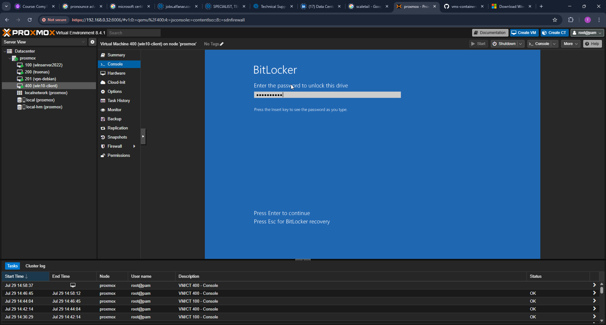
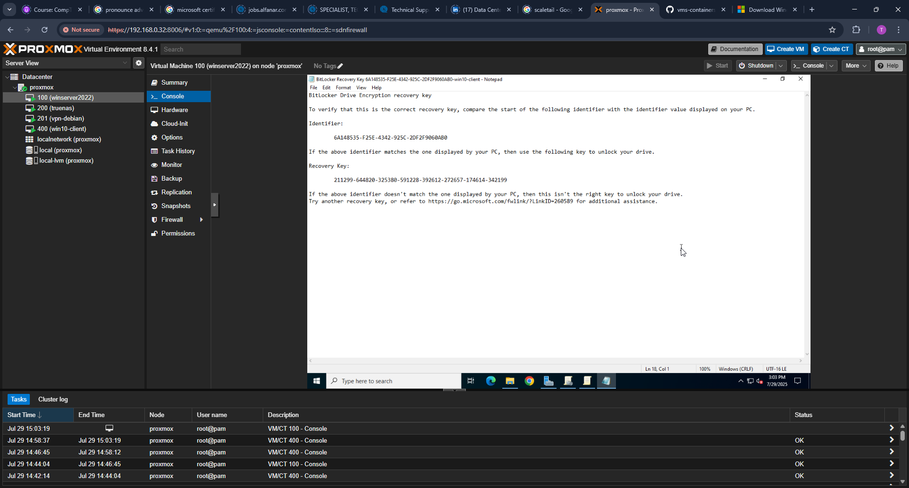
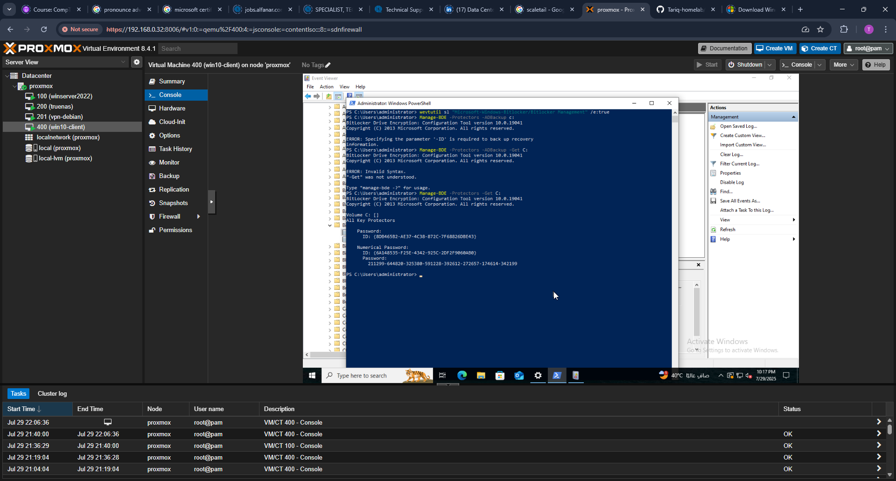
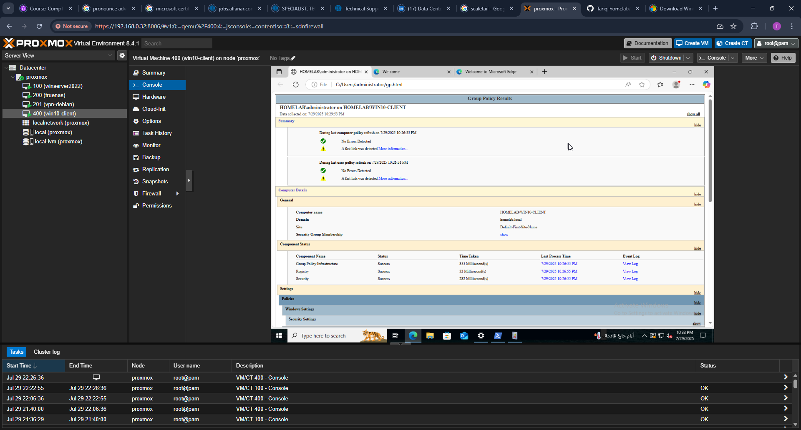
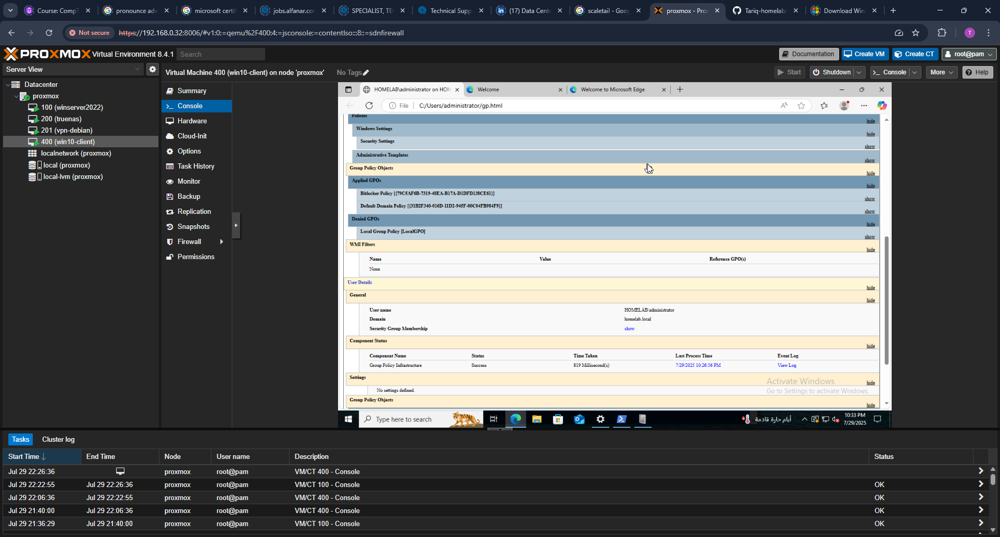
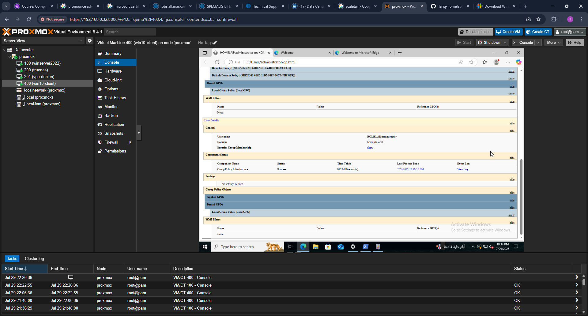

# BitLocker Group Policy Configuration and Validation

## Objectives

This lab demonstrates how to configure and enforce BitLocker drive encryption using Group Policy in a Windows Server 2022 Active Directory environment. It includes the following goals:

- Enforce TPM-based startup authentication for operating system drives.
- Configure BitLocker recovery key backup to Active Directory.
- Save recovery keys to a designated SMB network share.
- Verify encryption status through both GUI and PowerShell.
- Confirm storage of recovery keys in AD DS.
- Ensure auditing is enabled for security compliance.

---
## 1. Launch BitLocker Setup
BitLocker was launched via the Control Panel on the domain-joined client.

## 2. BitLocker Setup Wizard: TPM Detected
The setup wizard confirmed that a TPM was detected and required no additional PIN or USB.

## 3. Encryption Choice: Used Space Only
"Encrypt used disk space only" was selected for faster encryption on new devices.

## 4. Encryption Mode: New (XTS-AES)
Selected "New encryption mode" (XTS-AES) as the target machine is modern and supports it.

## 5. Run BitLocker System Check
Enabled the system check option to verify readiness before encryption.

## 6. Save Recovery Key: Choose Location
Selected a custom network path as defined by GPO for saving the recovery key.

## 7. Network Drive Mapped
Confirmed that the SMB network share was accessible and mapped successfully.

## 8. Save Recovery Key to Network
BitLocker exported the recovery key to the mapped SMB share.

## 9. Launching BitLocker Triggers GPO
BitLocker launched with pre-configured options set via Group Policy. Manual options were greyed out.

## 10. AD DS Recovery Key Storage Confirmed
Opened Active Directory Users and Computers (ADUC) to view the recovery key.

## 11. Select Network Share for Recovery Key
The wizard showed the SMB path defined in GPO during the save step.

## 12. Confirm Saved Recovery Key File
The recovery key file was successfully saved on the network share, confirming key export to the SMB
location.

## 13. Restart Prompt After Setup
After applying the BitLocker Group Policy settings, the system prompted for a restart to begin the encryption
process.

## 14. BitLocker Status: Encryption Started
Upon reboot, the BitLocker control panel displayed the status "Encryption in progress," confirming that drive
encryption had begun.

## 15. Pre-Boot Authentication Prompt (TPM)
The system displayed a pre-boot authentication screen confirming that TPM was used for BitLocker
protection, as configured in the Group Policy.

## 16. Recovery Key Stored in Active Directory
The recovery key was confirmed to be stored in Active Directory. It was accessed through the computer
objects properties under the "BitLocker Recovery" tab in Active Directory Users and Computers (ADUC).

## 17. Enable Event Logging (Optional)
BitLocker-related event logging was enabled to assist with auditing and troubleshooting.

## 18. Confirm BitLocker Event ID
Verified the Event ID 845 (BitLocker status) and 851 (Volume locked) in the Windows Event Viewer.

## 19. Verify GPO Configuration
Opened Group Policy Management Editor on the server to review the policy settings.

## 20. Test Another User Login
Logged in as another domain user on the encrypted machine to confirm policy enforcement.

---
## Next Steps
- Extend the lab to cover GPO-enforced BitLocker for removable drives.
- Implement automatic backup of recovery keys to secure off-site storage.
- Simulate drive failure scenarios and validate recovery key usage.
## Steps

### 1. Create BitLocker Policy GPO

A new GPO named **BitLocker Policy** was created under Group Policy Objects.


---

### 2. Edit Group Policy Settings

Navigated to:
```
Computer Configuration > Administrative Templates > Windows Components > BitLocker Drive Encryption > Operating System Drives
```

Enabled:
- **Require additional authentication at startup**
- **Choose how BitLocker-protected operating system drives can be recovered**


---

### 3. Allow TPM Startup Without PIN

Enabled the option to allow BitLocker to work with just TPM.


---

### 4. Save Recovery Key to AD DS

Configured recovery key storage in Active Directory Domain Services (AD DS).


---

### 5. Link GPO to Domain

The policy was linked to the `homelab.local` domain using Group Policy Management Console (GPMC).


---

### 6. Force GPO Update on Client

Used the following command on the client machine:

```powershell
gpupdate /force
```


---

### 7. Verify GPO Application (Resultant Set of Policy)

Confirmed that the BitLocker policy was applied using the `gpresult` tool.


---

### 8. Launch BitLocker

Accessed BitLocker Drive Encryption from Control Panel on the Windows 10 client.


---

### 9. BitLocker Setup Wizard

Began the BitLocker setup wizard for the operating system drive.


---

### 10. Select Recovery Method

Chose **Save to a file** as the recovery method to store the key on a network share.


---

### 11. Select Network Share

Navigated to the designated SMB path to store the recovery key.


---

### 12. Confirm Saved Recovery Key File

Confirmed that the recovery key was successfully saved to the SMB share.


---

### 13. Restart Prompt After Setup

After applying the GPO settings, the system prompted for a restart to begin encryption.


---

### 14. BitLocker Status: Encryption Started

The BitLocker control panel displayed "Encryption in progress."


---

### 15. Pre-Boot Authentication Prompt (TPM)

The system showed a pre-boot authentication screen confirming TPM-based startup.


---

### 16. Recovery Key Stored in Active Directory

Confirmed the recovery key was stored under the computer object's ADUC properties.


---

### 17. Enable Event Logging (Optional)

BitLocker auditing and logging were enabled for security visibility.


---

### 18. Verify Encryption via PowerShell

Used PowerShell to confirm encryption status:

```powershell
Get-BitLockerVolume
```


---

### 19. Retrieve Key Protector ID (PowerShell)

Retrieved the protector ID via:

```powershell
(Get-BitLockerVolume -MountPoint "C:").KeyProtector
```



---

### 20. Confirm gpresult Summary

Verified GPO summary confirms enforcement of policy.





---

## Summary

- Group Policy settings for BitLocker were created, linked, and enforced successfully.
- TPM-based protection was confirmed via pre-boot prompt.
- Recovery key was saved both to a network share and to Active Directory.
- Encryption status was verified through GUI and PowerShell.
- Auditing was enabled and tested.
- gpresult confirmed policy application from AD DS.

---

## Next Steps

Part 4 will focus on Active Directory user and group administration, OU structuring, and PowerShell-based automation.

